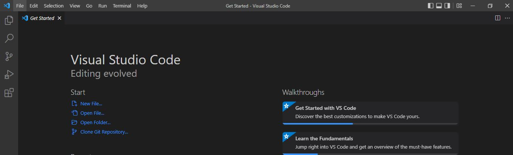

## Working with SSH  
**Step 1. Open Visual Studio Code**  
  

**Step 2. Click on terminal**  
**Step 3. Click "New Terminal"**  
**Step 4. Type  `ssh [cs-email address] ` and press enter**  
**Step 5. It should prompt you to enter a password. Note that when you type, your password will not be visible.**  
**Step 6.**
