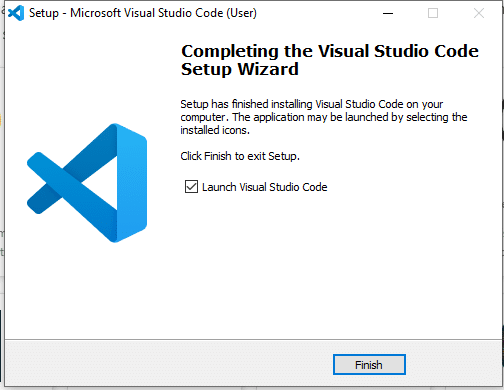
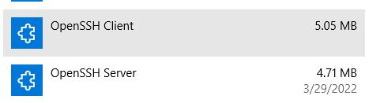
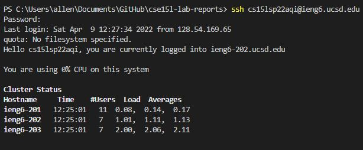
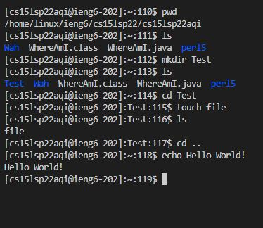
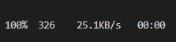
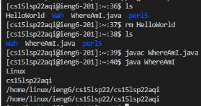
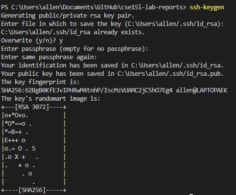
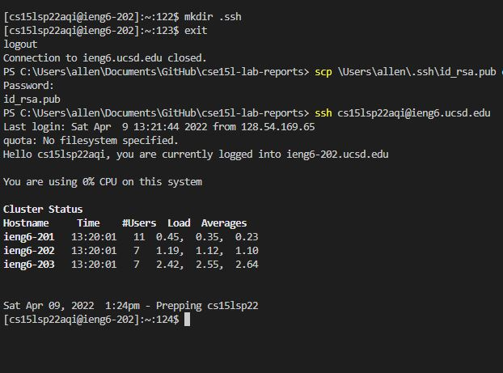
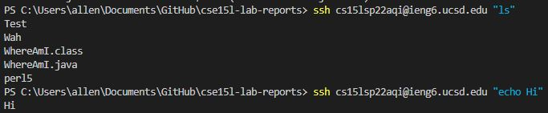
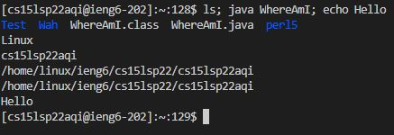

# _Remote Access & Easability_
**Here's a general tutorial on installing Visual Studio Code, SSH, Keys, and being efficient.** 

# Downloading Visual Studio Code & SSH
**Step 1. Click on the hyperlink to download [VSCode](https://code.visualstudio.com/) here**  
**Step 2. Run the installer, accept the agreement, and click next until it says install. Then press _Finish_.**   
  
**Step 3. Your computer needs to download the OpenSSH components. On Windows, you can go to the search bar and click on the gear for settings.**
**Step 4. Click on `Apps` or `Applications`. Look for an optional features category.**   
* _Note: you may need to lookup `optional features` from the search bar, if it is not clearly visible_  

**Step 5. Look for `OpenSSH Client` and `OpenSSH Server`, you may already have one or both of them already installed.**
  
**Step 6. If you need to download them, click on `Add a feature`, search them up, and press `Install`. It may take a couple minutes.**

### _**SSH is now present on your computer**_  
    

# Working with SSH  
**Step 1. Open Visual Studio Code**  
**Step 2. Click on terminal at the top bar**  
**Step 3. Click "New Terminal"**  
**Step 4. Go to [Account Lookup](https://sdacs.ucsd.edu/~icc/index.php), type in your username, and password. Look for an email address that follows the format of `cs15sp22zz@ieng6.ucsd.edu`, that's your course-specific email address.**
* _You may need to reset the password to that account, so follow the steps it provides._ 

**Step 5. Type  `$ ssh [cs-email address] ` and press enter**   
  * _If it is your first time, it will prompt a message similar to_  
  `The authenticity of host 'ieng6.ucsd.edu (128.54.70.227)' can't be established.  
   RSA key fingerprint is SHA256:ksruYwhnYH+sySHnHAtLUHngrPEyZTDl/1x99wUQcec.  
   Are you sure you want to continue connecting
    (yes/no/[fingerprint])?`
  * Type in `yes` or `y`

**Step 6. It should then prompt you to enter a password. Note that when you type, your password will not be visible.**  
**Step 7. You should see a screen that looks like **  
* _You are now connected to the Remote Server_

# Command Testing
There are many different commands you could try. I'll list a couple below and there are many more relevant ones [here](https://www.guru99.com/must-know-linux-commands.html).  
* `$ cd` : changes directories  
* `$ ls` : list directories 
  1. There are also hidden directories that could be found by doing `$ ls -a`
* `$ pwd`: prints the current directory
* `$ mkdir` : creates a new directory
* `$ cp` : copy a directory/file
* `$ touch` : creates a file without any content
* `$ cat` : creates /access a file with content 
* `$ rm [fileName] ` : removes/deletes
    1. can do `$ rm -d [directoryName]` to delete an empty directory
* `$ echo [text]` : prints text to terminal  
  
* **To logout, you can do _Ctrl + D_ or run the command `$ exit`**

# Moving files with `scp`
**So you can also transfer files from your local/client side to the remote server** 
1. Create a file in your local computer in VSCode, by right clicking in the gray space to the right of the left bar. 
2. Click on _New File_ and create a java file. For this example, I'll use `WhereAmI.java` with the code of

    * class WhereAmI {    
        public static void main(String[] args) {  
        System.out.println(System.getProperty("os.name"));  
        System.out.println(System.getProperty("user.name"));  
        System.out.println(System.getProperty("user.home"));  
        System.out.println(System.getProperty("user.dir"));    
    }  
}    
3. Run your file in the local terminal using `javac` and `java`. 
4. Type in `$ scp [fileName].java [csEmailAddress]:~/`
    * Example: `$ scp WhereAmI.java s15lsp22zz@ieng6.ucsd.edu:~/`
5. Type in your password, and you should see something similar to  
  
on the right side of the terminal
6. Log back onto the server using `$ ssh`
7. Type in `ls` and the file should show up. 
8. Run the `javac` and `java` command onto your file. It will work because it now exists on the server. 

# SSH Keys (no password logins)
**We don't have to put our password everytime we try to use SSH. There's a way to bypass that feature.**
1. On your client/local terminal, run `$ ssh-keygen`. Press enter several times until it shows a randomart image as shown

2. Login onto the remote server and run  `$ mkdir .ssh`, this will make a hidden directory to hold your ssh key.
3. Logout using `$ exit` or _Ctrl + D_ 
4. Copy over your public ssh key using the command  
`$ scp /Users/<user-name>/.ssh/id_rsa.pub cs15lsp22zz@ieng6.ucsd.edu:~/.ssh/authorized_keys `  
You would fill in "user-name" with your local username, and replace the cs email with yours.  
ex: `scp \Users\allen\.ssh\id_rsa.pub cs15lsp22aqi@ieng6.ucsd.edu:~/.ssh/authorized_keys`
5. Now the password will no longer be needed, since the remote server "remembers" your public key. The image cuts off the email part, but this is what it should look like. 

# Optimization and Efficiency
**You are capable of running commands in the remote server and then returning to the client quickly. This is done by running commands in the format of**  
`$ ssh [csEmail] "[command]"`
* Example:   
* 

**You can also run multiple commands in the same line/ at the same time**  
* Example:  
  
  
**Using the up arrow key will display the previous commands you've run, so you don't have to retype it if needed.**
