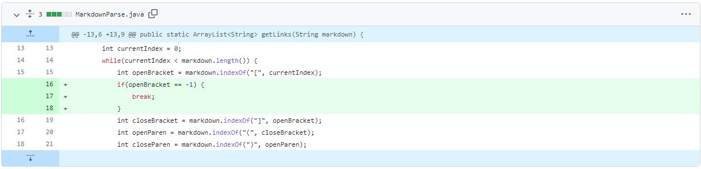
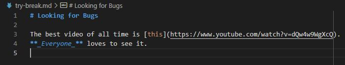
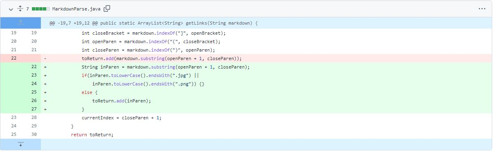
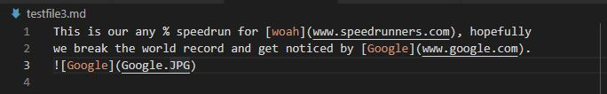
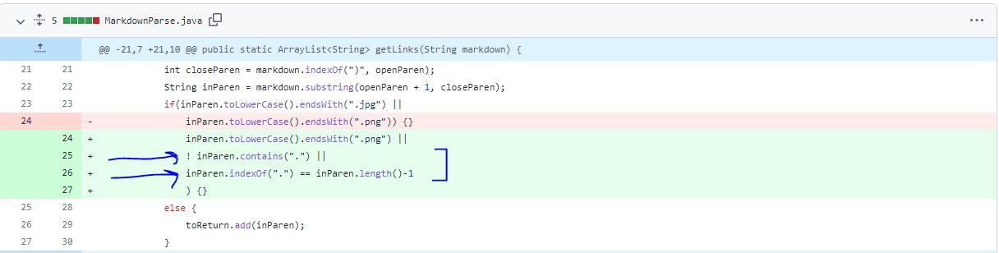
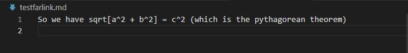
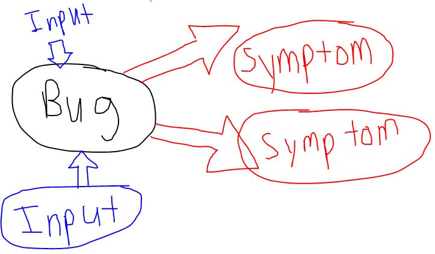

# *Debugging and Resolving*  
  

This page will be about the process of debugging and how bugs, inputs, and symptoms are connected. It will show 3 different issues with the [MarkdownParse.java](https://github.com/nidhidhamnani/markdown-parser/blob/main/MarkdownParse.java) we were provided, and how it was modified to fulfill its original intent.   
--> [MoreFunctionalMarkdown](https://github.com/AllKeng/markdown-parser/blob/main/MarkdownParse.java)

# Infinite Loop Error:   

### **Screenshot of the code change: **
The code needed to break the loop when `[]` braces were no longer found, once it searched through all the characters of the markdown file.
  
### ***Link to the test file for a failure-inducing input:***    
* [try-break.md](https://github.com/AllKeng/markdown-parser/blob/main/try-break.md) 
  
 

  
### **Symptom of bug in terminal:**
* Error message
```
Exception in thread "main" java.lang.OutOfMemoryError: Java heap space
        at java.base/java.util.Arrays.copyOf(Arrays.java:3512)
        at java.base/java.util.Arrays.copyOf(Arrays.java:3481)
        at java.base/java.util.ArrayList.grow(ArrayList.java:237)
        at java.base/java.util.ArrayList.grow(ArrayList.java:244)
        at java.base/java.util.ArrayList.add(ArrayList.java:454)
        at java.base/java.util.ArrayList.add(ArrayList.java:467)
        at MarkdownParse.getLinks(MarkdownParse.java:19)
        at MarkdownParse.main(MarkdownParse.java:30)
```

### **Relationship between the bug, the symptom, and the failure-inducing input**

* The bug is how the code searches for `[]` and `()` and increments its counting indices. The while loop depends on the current index which doesn't increment properly. 
* This buggy code would lead to the symptom of an OutOfMemoryError since the loop never ended. The failure-inducing input _initiated_ the failure of the bug and the symptom by not having the link be the last part of the markdown file.   
**Input --> Bug --> Symptom**


# Incorrectly includes images:  

### **Screenshot of the code change: **
The code needed to check for `.png` or `.jpg` and then ignore those parts when found. 
  
### ***Link to the test file for a failure-inducing input:***   
* [testfile3.md](https://github.com/AllKeng/markdown-parser/blob/main/testfile3.md)  



  
### **Symptom of bug in terminal:**
* Expected:  
```
[www.speedrunners.com, www.google.com]
```  
* Actual:  
```
[www.speedrunners.com, www.google.com, Google.JPG]
```  

### **Relationship between the bug, the symptom, and the failure-inducing input**
* The bug was how the code detected/searched for links. Basically it looked for markdown links by finding braces `[]` and parentheses `()`. This is flawed because links also include those as well. *---> in the form ``*   
* So when the failure-inducing input of an image was tested, it resulted in the inclusion the name of the image file. (aka the symptom)  
**The bug is a flaw in the code that when given a certain input will result in an unexpected symptom.** 


# May detects links when not present: 

### **Screenshot of the code change: **
The code needed to check if the String enclosed by the parentheses contained a `.` followed by additional characters. Since that's what a link contains. 
  
### ***Link to the test file for a failure-inducing input:***   
* [testfarlink.md](https://github.com/AllKeng/markdown-parser/blob/main/testfarlink.md)  



  
### **Symptom of bug in terminal:**
* Expected:  *empty list*
```
[]
```  
* Actual:    *not a real link*
```
[which is the pythagorean theorem]
```  

### **Relationship between the bug, the symptom, and the failure-inducing input**

* This bug is similar to the image one, since it's a flaw with how the code is designed. It searches for `[]` and `()`. It doesn't check for what's inside the parentheses. 
* The symptom exposes where the bug is, since it provides an output that programmers can analyze and see what part of the code provides that output.
* The failure-inducing input followed the buggy code and its design, which led to a logic error output. 

**Design flaw is the cause, failure-inducing input is the initiation, and the symptom is the effect**


# Conclusions:
* Bugs create the environment for failures and incorrect outputs
* Failure-inducing inputs will exploit/break these bugs 
* Symptoms can help us deduce where the bug is and what the problem is, by comparing an inputs expected value to its actual value.


