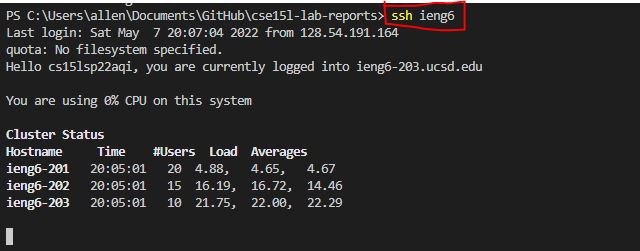
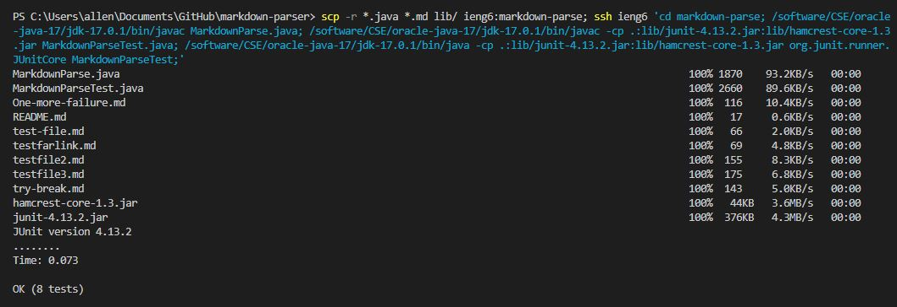

# *SSH Easability and Tricks*
Here are some tips and tricks to save some time working with the remote server and github. Some of them are super convenient and nice shortcuts to incorporate.   

# Streamlining ssh Configuration

* First I went to my `.ssh` folder and turned on file name extensions. It will be under the `View` tab.


* I right clicked on the empty space and went to the `New` tab and clicked on `Text Document`


* I opened the new text document using Windows Notepad and inputted


    1. `Host` represents the `<alias>`
    2. `Hostname` represents the `<domain>`
    3. `User` represents the `<Username>`
    4. `IdentityFile` is used if it stills prompts for a password. It represents the path to the private key.  

* I saved it with the name `config` and closed the file. However when looking at the file in the `.ssh` folder it says `config.txt` so I renamed it and removed the `.txt` extension and saved.

* Now, in the terminal I can just run 
```
$ ssh ieng6
$ ssh <alias>
``` 


* With the scp command, I can just run `scp` using the alias in this form.
```
$ scp <file> ieng6:~/  
```


# Setup Github Access from ieng6
This helps in directly committing and pushing from the ieng6 server, rather than from our local client. It saves time for Windows users if we want to run and create code from a Linux operating system, and have it work with Github Actions or something similar. 

* __My public key is stored on Github here__


* __My private key is stored in the `.ssh` directory__
  
*The red circle is around the `private` key, and the blue circle is around the `public` key*

* __Running git commands to commit and push from ieng6 account__
```
git add MarkdownParse.java
git commit -m "adding a line to test git cmds on ieng6"
git push origin main
```


* __Git Commit Link:__ [https://github.com/AllKeng/markdown-parser/commit/92fee54ec239cd536bc1726de13415bd3b8cd1c1](https://github.com/AllKeng/markdown-parser/commit/92fee54ec239cd536bc1726de13415bd3b8cd1c1)


# Copy whole directories with scp -r
This command recursively copies the whole directory over. Basically that means it copies the whole folder and sends it.  

* __Copying the whole markdown-parser directory to my ieng6__


* __Logging into ieng6 account and compiling/running the tests__


* __Copying files, logging into ssh, and running the commands in one line__
  
This is technically more efficient, but the command is quite long to realistically be used. But it is very convenient if it's saved for copy and paste or on the clipboard. 

* __Here's the command__
```
scp -r *.java *.md lib/ ieng6:markdown-parse; ssh ieng6 'cd markdown-parse; /software/CSE/oracle-java-17/jdk-17.0.1/bin/javac MarkdownParse.java; /software/CSE/oracle-java-17/jdk-17.0.1/bin/javac -cp .:lib/junit-4.13.2.jar:lib/hamcrest-core-1.3.jar MarkdownParseTest.java; /software/CSE/oracle-java-17/jdk-17.0.1/bin/java -cp .:lib/junit-4.13.2.jar:lib/hamcrest-core-1.3.jar org.junit.runner.JUnitCore MarkdownParseTest;'
```
* Due to the fact that we initially run the commands from the local client terminal, we have to add  
`software/CSE/oracle-java-17/jdk-17.0.1/bin/`  
before the `javac` or `java`, because it would run the files in a different version. This difference could cause a failure in compiling for __some__ cases.

* Similarly, we run multiple commands by including `;` in between commands, but if we want to do commands after a `ssh`, we have to put it in single quotes. For example:
```
ssh ieng6 'ls; pwd; cd ..'
```

# Final Result
Your ability to access the SSH remote server and Github should be more efficient. These shortcuts and tricks are especially useful in preparing test cases and direct changes to the repository. 
