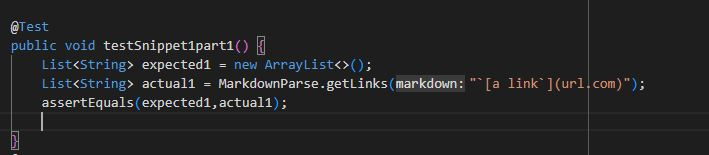
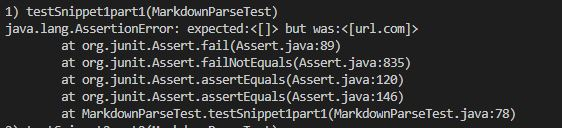
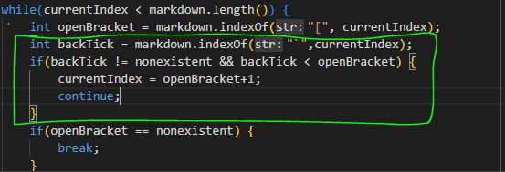
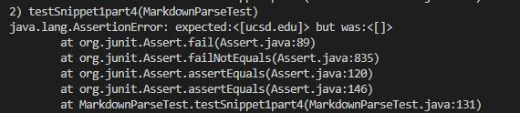

# Indepth Debugging and Testing 

* [My MarkdownParse Repository](https://github.com/AllKeng/markdown-parser)

* [MarkdownParse Repository Reviewed](https://github.com/Mnohem/markdown-parser)

* Website used to find expected values: 
[CommonMark Demo Site](https://spec.commonmark.org/dingus/)

    *I looked at the preview of the markdown and determined expected values by hovering over any of the blue links.*  
    
    **<span style="color:gold">Example:**  

    

# <span style="color:Cyan">Snippet 1

1. 
    ```
    `[a link`](url.com)
    ```
    **Expected:** []    

    

    **<span style="color:red">Mine Failed</span>**  

        

    **<span style="color:red">Theirs Failed</span>**  

          
    
* I think a small change that might fix this would be checking if backtick characters exist before the openBracket, and if so skip to the next iteration of the while loop with a currentIndex after the openBracket. The backtick is only significant if it is a character before the openBracket.   
  **We also might need to check if its already a closed set or just a single.**   
  **<span style="color:gold">Example:**  

    

2. 
    ```
    [another link](`google.com)`
    ```
    **Expected:** [`google.com]  

       
     
    **<span style="color:lime">Mine Passed</span>**  - This passed because the code checks for what is inside the parentheses, regardless of what special markdown character is there.    

    **<span style="color:lime">Theirs Passed</span>**
    

3.  
    ```
    [`cod[e`](google.com)
    ```
    **Expected:** [google.com]  

      

    **<span style="color:lime">Mine Passed</span>**   - This passed because the code checks for what is inside the parentheses, not the brackets.   

    **<span style="color:lime">Theirs Passed</span>**

4. 
    ```
    [`code]`](ucsd.edu)
    ```
    **Expected:** [ucsd.edu]  

      
      
    **<span style="color:lime">Mine Passed</span>** - This passed because the code checks for what is inside the parentheses, not the brackets.  

    **<span style="color:red">Theirs Failed</span>**  

    

# <span style="color:Cyan">Snippet 2

1. 
    ```
    [a [nested link](a.com)](b.com)
    ```
    **Expected:** [a.com]  

    

    **<span style="color:lime">Mine Passed</span>**  - This passed because the code detects the first parentheses pairing and then skips to the index after it, excluding the `b.com` from the list.   

    **<span style="color:lime">Theirs Passed</span>**
    
2. 
    ```
    [a nested parenthesized url](a.com(()))
    ```
    **Expected:** [a.com(())]  

      
    
    **<span style="color:red">Mine Failed</span>**  

       

    **<span style="color:red">Theirs Failed</span>**  

    

 * I think fixing this would be a big code change because we have to keep count of **how many** open and closing parentheses and brackets there are, make sure they **match up**, and account for the **latest parentheses pairing** that is still before the next iteration.   
 **<span style="color:gold">Example:</span>**  
 ` (a.com(())) `
 there are 3 parentheses pairs, so we would have to capture the substring from the first to the very last. (While stopping before the next potential openBracket)


3.  
    ```
    [some escaped \[ brackets \]](example.com)
    ```
    **Expected:** [example.com]

      
    
    **<span style="color:lime">Mine Passed</span>**  My code only cares about the string stored in between the parentheses.  
    **<span style="color:red">Theirs Failed</span>**  

    

# <span style="color:Cyan">Snippet 3  

  

1. 
    ```
    [this title text is really long and takes up more than 
    one line

    and has some line breaks](
        https://www.twitter.com
    )
    ```
    **Expected:** []  

    

    **<span style="color:red">Mine Failed</span>**  

    

    **<span style="color:red">Theirs Failed</span>**  

      

* I think a small code change that would fix this new line problem would be to check to see if there are multiple newlines stored within the brackets. We can do this by removing one newline from the substring, then checking for another. If there are multiple, we go to next iteration with a currentIndex after the closing bracket.  

 **<span style="color:gold">Example:</span>**  

 

2. 
    ```
    [this title text is really long and takes up more than 
    one line](
    https://sites.google.com/eng.ucsd.edu/cse-15l-spring-2022/schedule
    )
    ```
    **Expected:** [https://sites.google.com/eng.ucsd.edu/cse-15l-spring-2022/schedule]  

    

    **<span style="color:red">Mine Failed</span>**  

      
    
    **<span style="color:red">Theirs Failed</span>**  

    

* I think a small code change could definitely solve this problem as well. It's very similar to the newline problem of brackets, but just with parentheses. The same if statements apply. We could even make a helper method for it. But for now  
**<span style="color:gold">Example:</span>**  

  

It removes a single newline and checks for more, if there's multiple, it'll go to next while loop iteration with the currentIndex being after the closeParen. We also have to trim after this check has occurred.
  
3. 
    ```
    [this link doesn't have a closing parenthesis](github.com

    And there's still some more text after that.
    ```
    **Expected:** []  

      

    **<span style="color:lime">Mine Passed</span>**  - This passed because the code change of checking for the closing parentheses and if it exists.  
    **<span style="color:lime">Theirs Passed</span>**

4. 
    ```
    [this link doesn't have a closing parenthesis for a while](https://cse.ucsd.edu/


    )

    And then there's more text

    ```
    **Expected:** []

    

    **<span style="color:red">Mine Failed</span>**  

      

    **<span style="color:red">Theirs Failed</span>**  

      

* Same small code change solution as Snippet 3, Part 2. Just have to check for multiple new lines and iterate or keep going accordingly.

# <span style="color:Cyan">Overall Changes
For snip 1, I just need to check for backTicks being prior to the openBracket and see if it's already closing or not. Small conditional checks are possible, it doesn't have to be too crazy.


For snip 2, I would need a large code change in order to address closed or open parentheses sets. I have probably need a helper method to see if each pair of parentheses were closed. I would also need to account for the last closingParen and not the first occurance. This would come with a condition that it is before then next openBracket as well.  

For snip 3, I would need a small code change that checks for newlines that aren't at the boundaries of the openParentheses and closeParenthesess. If there are, then that section is skipped and not included in the list.


My code did have several already successful cases that arose from the assumption that we only needed to care about the characters stored within the parentheses.

# <span style="color:Cyan">Final Thoughts
In most cases, small changes are necessary to address certain problems and bugs. In others though, if we have to keep track of many things, it may be necessary for larger code adjustments. 

**I now know of more ways of testing String methods, by testing with newlines, backticks, spaces, and other special characters.**

Similarly, I will try testing my code with more syntax adjustments as well to see my code will have false detections or whatnot.