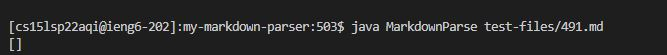

# **<span style="color:Blue">Code Comparison and Debugging**

I did find a couple tests with different results. However, I needed to rename several files in the directory, and exclude them, due to some of them causing infinite loops. I used **vimdiff** to view differences between the results of both my markdown parser and the provided parser, and **manually picked out two**.

* Website used to find expected values: 
[CommonMark Demo Site](https://spec.commonmark.org/dingus/)

    *I looked at the preview of the markdown and determined expected values by hovering over any of the blue links.*  

* **Commands used:** 
```
$ cd my-markdown-parser/
$ bash script.sh > results.txt

$ cd cse15ls2p22-markdown-parser/
$ bash script.sh > results.txt 

$ vimdiff my-markdown-parser/results.txt cse15lsp22-markdown-parser/results.txt
```


*(saving the outputs to `result.txt` file)*

*(using `vimdiff` to see differences in output)*


# **<span style="color:aqua"> Discussing two testfiles that had different outputs**

* `test-files/342.md`

    Link to the test-file: [https://github.com/nidhidhamnani/markdown-parser/blob/main/test-files/342.md](https://github.com/nidhidhamnani/markdown-parser/blob/main/test-files/342.md)


* `test-files/491.md`  

    Link to the test-file: [https://github.com/nidhidhamnani/markdown-parser/blob/main/test-files/491.md](https://github.com/nidhidhamnani/markdown-parser/blob/main/test-files/491.md)


# For Test-Files/342.md
```
[not a `link](/foo`)
```

**<span style="color:lime">My implementation is correct,<span style="color:red"> while the given implementation gives the wrong output.**

**Expected Output:** <span style="color:gold">[]


_From the CommonMark demo site_

**My Output:** <span style="color:gold">[]


**Other Output:** <span style="color:gold">[/foo`]


* The bug is that the given implementation of MarkdownParse seems to ignore the backtick's presence within the link structure. It believes that the backtick is also included within the link, rather than a symbol that changes the text format.

    <span style="color:aqua">--> The code doesn't check for special characters that affect text formatting, so incorrectly believes it is part of the link.

**<span style="color:lime">Potential Solution: </span>**
1.  Add a conditional statement that checks to see if there are backticks present within the parentheses. *(It could be in the form of a helper method or an if statement.)*  
2. Then check to see if there are backticks before the parentheses set.
3. If there are, don't add the link.

**Ideally the code change would occur here**


The highlighted line would be a great spot, as it already checks the string of a potential link so adding another condition would be fine. 


# For Test-Files/491.md
```
[a](<b)c>)
```

**<span style="color:red">  Both of the MarkdownParser are wrong, as both had the wrong output. Neither implementation were successful with this test-file. </span>** 

**Expected Output:** <span style="color:gold">[b)c]


_From the  CommonMark demo site_

**My Output:** <span style="color:gold">[]



* The bug is that my code incorrectly believes that links must contain a `.` within them, so it excludes any substrings that do not contain a period. It will ignore any string without a period, which the commonmark.js dingus doesn't do. 

    <span style="color:aqua">-->My code is quite narrow and specific to certain cases, so it has a small net of correctly catching false inputs. It has an assumption of what structures links should be, which stops it from matching a real parser.

**Ideally the code change would occur here**


If the highlighted text were removed, I believe my implementation would add some part of the string into the list, but not exactly the *correct* part.

**Other Output:** <span style="color:gold">[<b]


* The bug is that the given implementation is detecting the wrong closing parentheses. It seems to add the substring within the first open parenthesis and first closing parenthesis, rather than the first and last(which would work here)

* I think that the `<>` and the `()` pairs are being meshed in a way that makes the code buggy with where the parentheses are in terms of where the `<>` sets are.

    <span style="color:aqua">--> The implementation has a flaw in how it detects parentheses and special text formatting pairs that makes it exclude certain characters, quite possibly due to a mismatch.

**Ideally the code change would occur here**


**<span style="color:lime">Potential Solution: </span>**  

* Somewhere in that highlighted section, there should be a special condition that checks to see if there are any special text formatting characters *(Specifically opening and closing characters )* 

    <span style="color:magenta">Perhaps in the while loop and the conditional statements within it.

* If one of the special text formatting pair wraps around one of the parenthesis, that parenthesis could be skipped from detection.


# Concluding Remarks

**Different implementations could have different outputs. One could be right, one could be wrong, both could be wrong. Similarly, they could have different bugs and different symptoms. Not all solutions work for everyone.** 

<span style="color:aqua"> Here I had two test files with different bugs and different solutions.

We need to be careful when dealing with bugs as we can't just charge head first and make changes. We have to think about the bug and what occurs in the code, in order to understand it and fix it properly. 